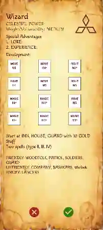
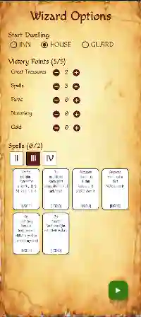

# HEROLAND

Heroland is an attempt to simplify the Magic Realm board game (Avalon Hill 1979).
The game's bulky rulebook and difficulty in learning have always caused some rejection among players, despite the fact that the game is in early development at [LostRealm](https://github.com/Manolek1975/lostrealm).
I've tried to maintain the essence of the original game, although many aspects have obviously been replaced. The 16 strength, movement, and magic tokens have been simplified to general hero tokens such as strength, speed, magic, and color.
The map has been simplified to 20 random areas to be discovered and explored, while retaining the warning and sound tokens for generating random encounters.

## Images

   

